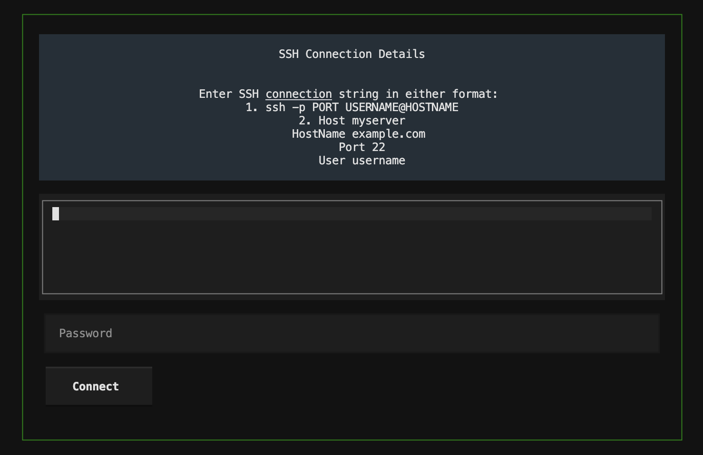
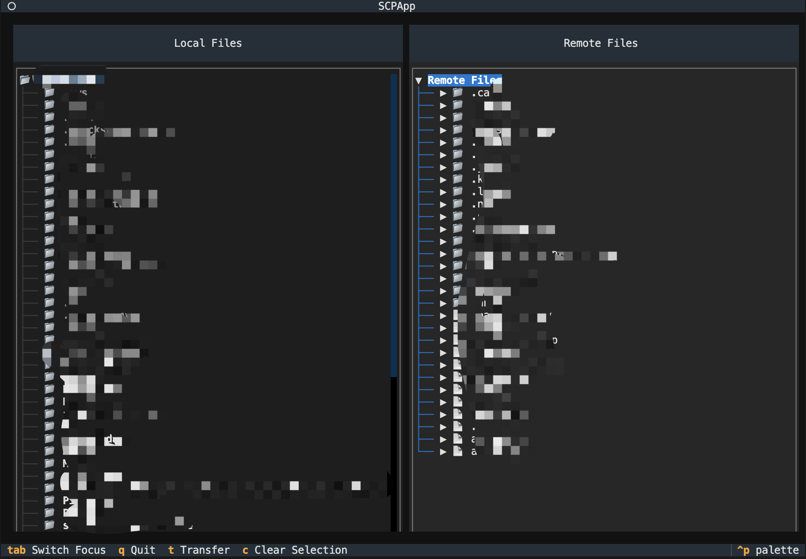
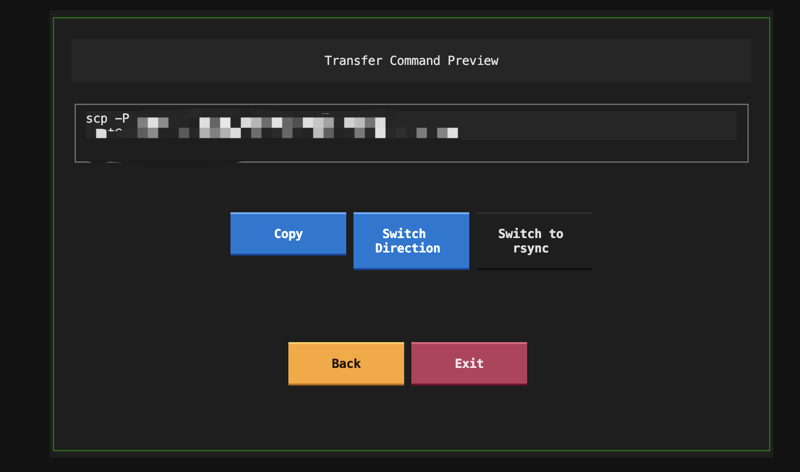

# Teleport TUI (tptui)

A modern Terminal User Interface (TUI) for generating SCP and RSYNC commands. This tool helps you visually browse local and remote files, then generates the appropriate transfer commands which you can copy to your clipboard and execute in your terminal.


## Screenshots

### SSH Connection


### File Browser


### Command Preview


## Features

- 🖥️ Intuitive terminal-based user interface
- 📂 Visual file browser for both local and remote systems
- 🔄 Support for both SCP and RSYNC command generation
- 📋 Command preview with clipboard integration
- 🔀 Easy switching between transfer directions (local→remote, remote→local)
- ⏸️ Support for generating resumable transfer commands (with RSYNC)
- 🔒 Secure password handling for SSH connections

## Installation

1. Clone the repository:
```bash
git clone https://github.com/Shunxing-Fan/tptui.git
cd tptui
```

2. Install dependencies:
```bash
pip install -r requirements.txt
```

## Usage

1. Start the application:
```bash
python main.py
```

2. Connect to your remote server:
   - Enter your SSH connection details in either format:
     ```
     ssh -p PORT USERNAME@HOSTNAME
     ```
     or
     ```
     Host myserver
     HostName example.com
     User username
     ```
     Note: Port specification is optional if using default port 22
   - Enter your password when prompted

3. Navigate the interface:
   - Use arrow keys to browse files
   - Press `Tab` to switch between local and remote panels
   - Press `Enter` to select files/directories
   - Press `T` to open command preview
   - Press `C` to clear selection
   - Press `Q` to quit

4. Generate and use transfer commands:
   - Select source and destination files/directories
   - Choose between SCP and RSYNC command types
   - Set transfer direction (local→remote or remote→local)
   - Preview the generated command
   - Copy the command to your clipboard
   - Paste and execute the command in your terminal

## Keyboard Shortcuts

| Key   | Action                    |
|-------|---------------------------|
| Tab   | Switch between panels     |
| Enter | Select file/directory     |
| T     | Open command preview      |
| C     | Clear current selection   |
| Q     | Quit                     |

## Contributing

Contributions are welcome! Please feel free to submit a Pull Request.

## License

This project is licensed under the MIT License - see the [LICENSE](LICENSE) file for details.

## Acknowledgments

- Built with [Textual](https://github.com/Textualize/textual)
- Uses [Paramiko](https://github.com/paramiko/paramiko) for SSH connectivity 
